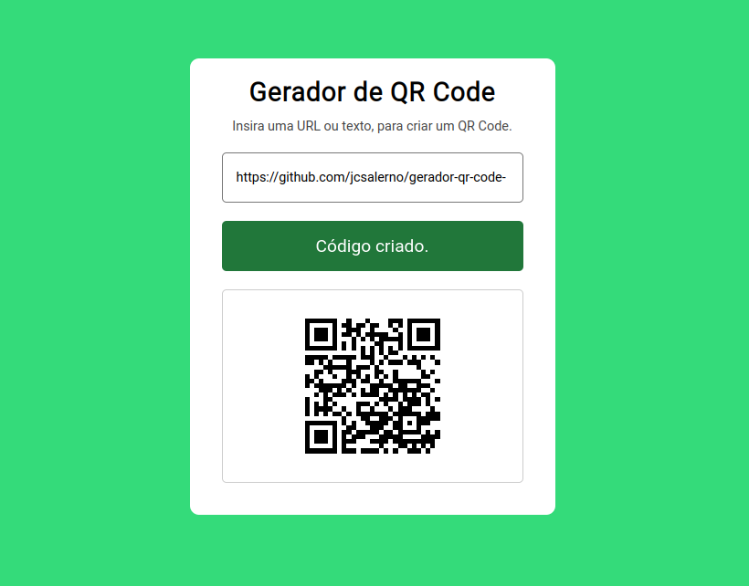

# Gerador de QR Code

Este é um projeto simples de gerador de QR Code. Ele permite que você insira uma URL ou texto e gere um QR Code correspondente.

## Visão Geral

Este projeto consiste em um arquivo HTML (`index.html`) e um arquivo CSS (`style.css`) que definem a interface do usuário. Ele também inclui um arquivo JavaScript (`script.js`) para lidar com a geração do QR Code. A página da web tem uma interface de usuário minimalista, onde você pode inserir a URL ou texto desejado e gerar o QR Code correspondente.

## Pré-requisitos

Nenhum software ou bibliotecas adicionais são necessários para executar este projeto. Tudo o que você precisa é de um navegador da web para abrir o arquivo HTML.

## Como Usar

1. Abra o arquivo `index.html` em seu navegador da web.

2. Digite a URL ou texto que você deseja converter em um QR Code no campo de entrada.

3. Clique no botão "Gerar QR Code".

4. O QR Code gerado será exibido na página.

## Exemplo

